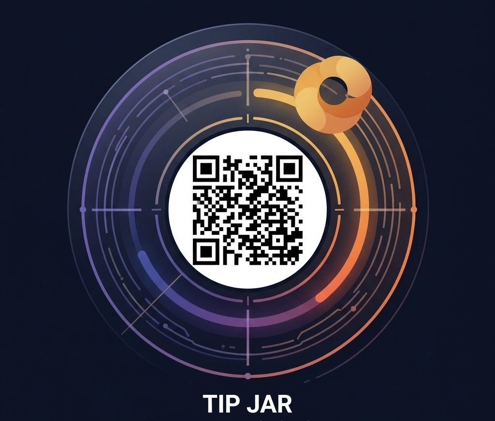

# Custom-Sensor-Telemetry-Select


Custom Telemetry Card for Home Assistant
now supports a sensor picker and dynamically chooses the display style per sensor based on sensor metadata, units, names, and whether the value is numeric or text. That matches Home Assistant’s custom card model, where the frontend card can inspect entity state/attributes and render different UI based on what it finds!

The card now:

•	accepts either a  ```base_entity_prefix```  or an ```explicit sensor list```

•	shows a checkbox-based sensor picker in the card,

•	auto-classifies sensors into temperature, usage, power, memory, speed, bandwidth, counters, numeric metrics, or status,
and picks the best tile style automatically, such as bar + sparkline for percentages, sparkline-only for temps/speeds, or status tiles for text sensors


How classification works It looks at:

•	unit_of_measurement

•	entity/friendly name patterns like  temp ,  utilisation ,  power ,  clock ,  download ,  upload ,  codec ,  session ,  state , and whether the state is numeric. That lets one card work for GPU telemetry, other device telemetry, and mixed sensor sets without hardcoding every suffix.


Quick Setup

  Download custom-sensor-telemetry-select.js and copy it to the /www/ folder inside your ha config

Add the resource to your ha front end (Go to Settings → Dashboards → Resources
Add /local/custom-sensor-telemetry-select.js as a JavaScript Module
```
URL: /www/custom-sensor-telemetry-select.js
TYPE: JavaScript module
```

REBOOT HA 

Add a new manual card to your front end
```
type: custom:custom-sensor-telemetry-select
title: Tower GPU Telemetry
device_name: Nvidia GTX 1650
base_entity_prefix: sensor.nvidia_geforce_gtx_1650_tower_gpu0_
accent_color: "#ff8c42"
sensor_picker: true
history_hours: 6
use_real_history: true
show_sparklines: true
compact: false
group_by_type: true
shared_scale: true
show_range_controls: true
mode_overrides_text: |
  sensor.nvidia_geforce_gtx_1650_tower_gpu0_power_draw=line
  sensor.nvidia_geforce_gtx_1650_tower_gpu0_encode_sessions=bar
  encode_codec=status
  gpu_utilisation=barline
```
Edit the base_entity_prefix to whatever sensor you wish, click save. 
Click edit again and you should now be able to use the Visual Editor 


```
ROADMAP
add hacs specific install instructions; once approved
```

## Tip Jar

[](https://venmo.com/u/Fiservedpi32)

[Donate to the Galactic Federation](https://venmo.com/u/Fiservedpi32)

<br clear="left" />


